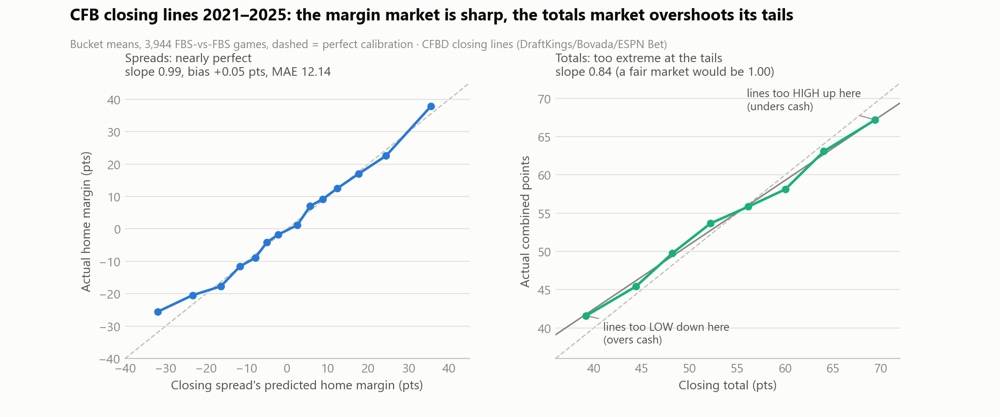
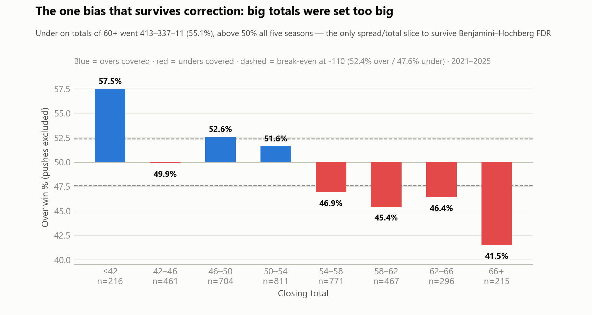
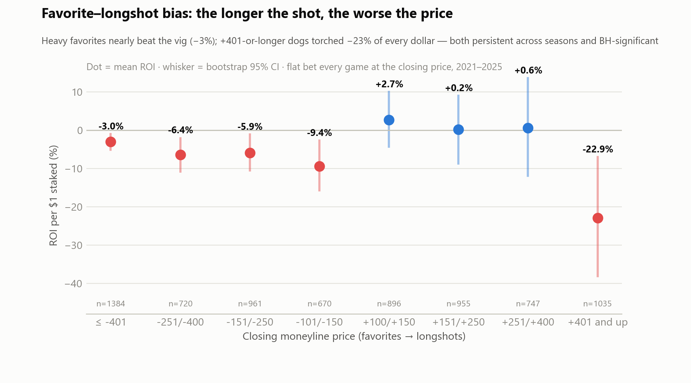
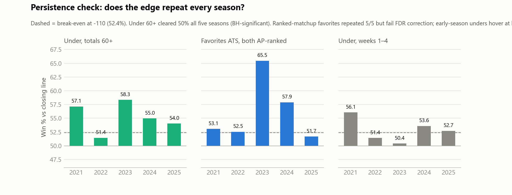

# Market Post-Mortem — CFB Closing Lines, 2021–2025

How did the books' closing numbers do against reality, and what did they
systematically miss? 3,944 FBS-vs-FBS games, closing spread/total/moneyline
from CFBD (DraftKings → Bovada → ESPN Bet provider preference), graded against
final scores. 57 pre-specified strategy slices, exact binomial tests,
Benjamini–Hochberg FDR at q=0.10, and a 4-of-5-seasons persistence rule.
Break-even at -110 juice: **52.38%**.

## TL;DR (podcast version)

1. **The spread market is nearly perfect.** Systematic bias vs the closing
   spread: +0.05 points over five years (the typical game still misses the
   number by ~12 either way — noise, not bias). Slope of actual-on-predicted
   margin: 0.99.
   There is no home/away, favorite/dog, bye-week, or rivalry ATS edge that
   survives correction. If someone claims a simple ATS system, they're selling
   noise.
2. **The totals market is NOT.** Regress actual points on the closing total and
   the slope is **0.84**, five standard errors below fair. The books overshoot
   both tails: totals of 60+ went **UNDER 55.1%** (413–337–11, +5.1% ROI,
   cleared 50% all five seasons, survives FDR) and totals of 42-or-less went
   **OVER 57.5%** (n=216, exploratory). When the market expects chaos, it
   overprices the chaos.
3. **Favorite–longshot bias is alive on moneylines.** Flat-betting every
   -401-or-heavier favorite lost only 3.0% to the vig; every +401-or-longer
   dog torched **-22.9% of every dollar** (101 wins in 1,035 bets). The devig
   curve confirms it: implied 10% dogs won 8.3%; implied 90% favorites won
   91.9%. Both tails persistent, both BH-significant.
4. **The close is sharp — chasing steam is dead money.** Following spread moves
   of a point or more went 49.5% against the close. But dogs graded against
   the *opening* number beat dogs at the close (51.3% vs 50.5%): openers lean
   a touch favorite-heavy, and the value is gone by kickoff.
5. **Watch list, not bet list:** ranked-vs-ranked favorites covered 56.1%
   (5/5 seasons, p=.048 — fails FDR), early-season unders 52.8% (5/5, ~break-
   even), G5-vs-G5 dogs 52.1%. Real-ish patterns, not yet proof.

---

## 1. The dataset

| | 2021 | 2022 | 2023 | 2024 | 2025 | total |
|---|---|---|---|---|---|---|
| games with closing spread | 770 | 776 | 792 | 798 | 808 | **3,944** |
| with total | 770 | 776 | 792 | 798 | 808 | 3,944 (3,891 graded) |
| with moneyline | 721 | 708 | 772 | 787 | 783 | 3,771 |
| with open+close (same book) | 770 | 769 | 792 | 798 | 808 | 3,937 |

Regular + postseason, FBS-vs-FBS only, completed games. One book per game by
preference (DraftKings, then Bovada, then ESPN Bet, then William Hill); line
*movement* is always open→close within the same book (Bovada is the only book
with opens in all five seasons). Spread convention is home-perspective,
matching `backtest_upset_alert.py`.

## 2. Calibration: how good is the close?

| | Spreads | Totals |
|---|---|---|
| mean error (actual − line) | **+0.05 pts** (SE 0.24) | +0.35 pts (SE 0.25) |
| MAE / RMSE | 12.14 / 15.34 | 12.56 / 15.81 |
| slope, actual on predicted | **0.99** (fair = 1.00) | **0.84** (≈5 SE below 1.00) |
| R² | 0.43 | 0.14 |

**Spreads: unbiased, and calibrated bucket by bucket.** No spread range shows
a cover rate that survives correction. Season-level bias drifted from −0.5/−0.7
(2021–22, home sides a hair overpriced) to +0.7/+0.8 (2024–25, home sides a
hair underpriced) — a mild post-COVID home-field story worth watching, but home
ATS overall was 50.4%, i.e. nothing.

**Totals: the lines are more extreme than reality.** Fitted line:
`actual ≈ 8.8 + 0.84 × closing total`. At a 70-total the market overshoots by
~2.2 points; at a 40-total it undershoots by ~2.4. This is the one structural
miscalibration in the dataset.

**Moneylines: well-ordered, mispriced at the tails.** Brier 0.185 on devigged
home probabilities. Middle buckets track within ~2 points of implied;
the tails don't (see §3, moneyline card).

## 3. Bet-type report cards

### Spreads — grade: A

Nothing survives. Home ATS 50.4% (1790–1762–71). All dogs 50.5%. Home dogs
51.3%, off-bye teams 51.3%, rivalry dogs 52.3% (n=180, curated list), G5 side
vs P4 47.9% — all inside noise. Steam-follow 49.5%. The only 5/5-persistent
spread pattern is ranked-vs-ranked favorites (56.1%, n=285 games, p=.048), and
it *fails* FDR — watch list.

### Totals — grade: B−

Overall over/under split 49.3/50.7 — fine. By size, not fine:

| closing total | n | over% | verdict |
|---|---|---|---|
| ≤42 | 216 | **57.5** | lines too low (exploratory — small n) |
| 42–46 | 461 | 49.9 | fair |
| 46–50 | 704 | 52.6 | fair-ish |
| 50–54 | 811 | 51.6 | fair |
| 54–58 | 771 | 46.9 | shading high begins |
| 58–62 | 467 | 45.4 | too high |
| 62–66 | 296 | 46.4 | too high |
| 66+ | 215 | **41.5** | way too high |

**Under on 60+ totals: 413–337–11 (55.1%), +5.1% ROI, over 50% in all five
seasons, and the only spread/total strategy to survive Benjamini–Hochberg.**

Caveat that matters: the shootout bucket is shrinking (212 games with 60+
totals in 2021 → 87 in 2025) as CFB scoring fell and books adjusted. The edge
held at 54–55% in 2024–25, but assume decay, not permanence.

### Moneylines — grade: C at the tails

Flat-bet ROI per $1 staked, closing prices:

| band | n | win% | ROI | bootstrap 95% CI |
|---|---|---|---|---|
| favs ≤ −401 | 1,384 | 86.7 | **−3.0%** | (−5.1, −1.0) |
| favs −251/−400 | 720 | 71.3 | −6.4% | (−10.8, −2.1) |
| favs −151/−250 | 961 | 62.2 | −5.9% | (−10.5, −1.1) |
| favs −101/−150 | 670 | 51.3 | −9.4% | (−15.7, −2.7) |
| dogs +100/+150 | 896 | 46.0 | +2.7% | (−4.3, +10.0) |
| dogs +151/+250 | 955 | 33.9 | +0.2% | (−8.7, +9.0) |
| dogs +251/+400 | 747 | 24.4 | +0.6% | (−11.9, +13.6) |
| dogs +401 and up | 1,035 | 9.8 | **−22.9%** | (−38.1, −7.0) |

The classic favorite–longshot shape: heavy chalk is priced almost fairly
(you lose less than the vig), moderate dogs are roughly fair, and lottery-
ticket dogs are massively overpriced. 2022 was the lone longshot-friendly
season (+41.9% — remember 2022; the market does). One more split that
survived FDR: **away dogs ML bled −10.9%** while home dogs lost only −1.2% —
if you're buying underdog moneylines at all, the live ones were at home.

### Line movement — the close wins

* Follow steam (≥1 pt move, bet the side the money came on, at the close):
  **49.5%** (n=2,241). Big steam (≥2.5): 51.2%, still noise.
* Dogs graded at the **open**: 51.3%. Same games at the **close**: 50.5%.
  Openers lean slightly chalky; the market corrects toward dogs by kickoff.
  Translation: if you like a dog, bet it early; if you missed the number,
  the close is fair and you're just paying vig.

## 4. What they missed — ranked

| rank | miss | size | persistence | survives FDR? |
|---|---|---|---|---|
| 1 | Longshot ML dogs (+401+) overpriced | −22.9% ROI | 4/5 seasons | **yes** |
| 2 | High totals (60+) set too high | 55.1% unders, +5.1% ROI | 5/5 | **yes** |
| 3 | Away-dog moneylines overpriced vs home dogs | −10.9% vs −1.2% | 4/5 | **yes** |
| 4 | Short favorites (−101/−150) shaded | −9.4% ROI | 4/5 | **yes** |
| 5 | Ranked-vs-ranked favorites cover | 56.1% ATS | 5/5 | no — watch list |
| 6 | Low totals (≤42) set too low | 57.5% overs | (bucket n=216) | exploratory |
| 7 | Early-season unders | 52.8% | 5/5 | no — ~break-even |
| 8 | G5-vs-G5 dogs | 52.1% | 4/5 | no — watch list |

Everything else we tested — home/away, favorite/dog ATS by spread size, P4/G5
ATS, cross-conference, byes, short rest, rivalries, steam — the market prices
correctly. **The books' one systematic blind spot is the tails: extreme
totals and extreme moneylines.** Both are the same behavioral story: the
public pays a premium for fireworks (overs, longshots), and the books shade
into that demand rather than at true odds.

## 5. Statistical honesty

* 57 strategies tested. At raw p<0.05, ~3 would "hit" by chance alone even if
  the market were perfectly efficient; 10 did. Benjamini–Hochberg (q=0.10)
  kept 8, and all 8 tell one of two coherent stories (totals tail, ML tail) —
  coherence across adjacent slices is itself evidence. Isolated one-bucket
  wonders (e.g. "dogs 7.5–10" at 46.8%) are in `slice_results.csv` and should
  be treated as dead.
* Persistence rule: pooled direction repeated in ≥4 of 5 seasons with ≥25
  decided bets per season. "Under 55–59.5" hit p=.032 but only 3/5 seasons —
  reported as noise despite the p-value.
* ATS/totals ROI assumes -110 both ways; real juice varies, and 2021–22
  closing lines are Bovada-heavy (DraftKings didn't enter CFBD's feed until
  2023). Single-book grading understates what a line-shopping bettor gets.
* Moneyline CIs are bootstrap percentile (heavy-tailed returns); n=3,771 of
  3,944 games had two-way ML prices.
* Rankings = AP poll in the game's week; rivalry flag = curated 39-pair list
  (180 games); rest days derived from schedule gaps (bye = 13+ days).
* Postseason included (210 graded dogs, 48.1% — nothing there, but bowls
  carry opt-out/motivation noise we didn't model).

## 6. Proposed workbook integrations (not built)

1. **Total-tail flag (Upset Board / conference tabs).** When a 2026 game's
   posted total is in the season's top decile (percentile-based, not a fixed
   60 — the scoring era moved), show an `U-TAIL` chip next to the line. The
   backtest says that chip alone was worth 55% / +5% ROI. Percentile keeps it
   honest as books keep adjusting.
2. **Longshot guardrail on RED upset alerts.** RED alerts are "dog wins
   outright" calls. When the dog's moneyline is +401 or longer, the alert
   should render ATS-only (suppress the ML framing): the market's worst-priced
   product is exactly the lottery ticket the alert would otherwise point at.
   Home dogs get a pass (−1.2% vs −10.9% for road dogs).
3. **CLV column in `alerts_log.json` grading.** The ledger already stores
   first-seen lines; add close-vs-first-seen so every alert gets a closing-
   line-value grade. Since steam-following showed no edge vs the close, CLV
   is the cleanest single measure of whether the alert engine is actually
   early or just loud.
4. **Watch-list tracker tab.** Ranked-vs-ranked favorites, early-season
   unders, G5vG5 dogs: log them live in 2026 as paper bets. If any clears
   break-even on fresh data, it graduates; none of them is bettable on the
   2021–25 evidence alone.

## Files

| file | what |
|---|---|
| `market_bets_2021_2025.csv` | per-game, per-bet dataset (slice it in Excel) |
| `slice_results.csv` | all 57 tests: records, CIs, p-values, BH flags, per-season splits |
| `results.json` | calibration curves + headline stats (chart inputs) |
| `fetch_data.py` → `build_dataset.py` → `analyze_market.py` → `make_charts.py` | the pipeline, in order |
| `charts/*.png` | the four headline charts |

*Phase 2 (NFL 2021–2025, NBA 2011–2021) is done — see
[MARKET_POSTMORTEM_PHASE2.md](MARKET_POSTMORTEM_PHASE2.md). Short version:
the NFL prices everything, the NBA prices almost everything, and the biases
above are thin-market (CFB) phenomena.*
