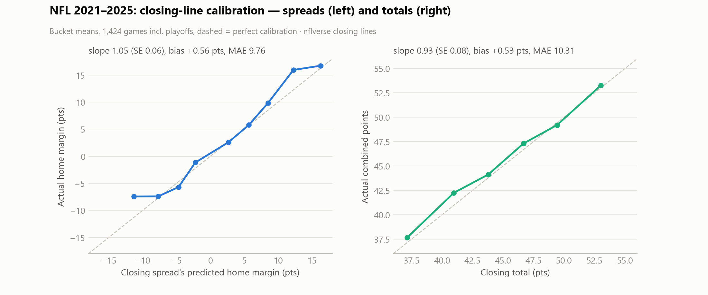
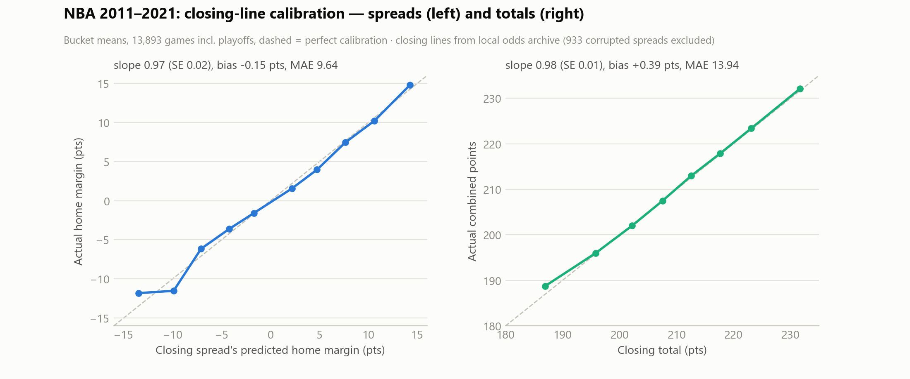
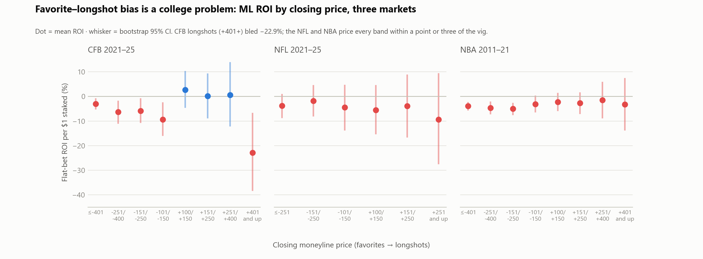
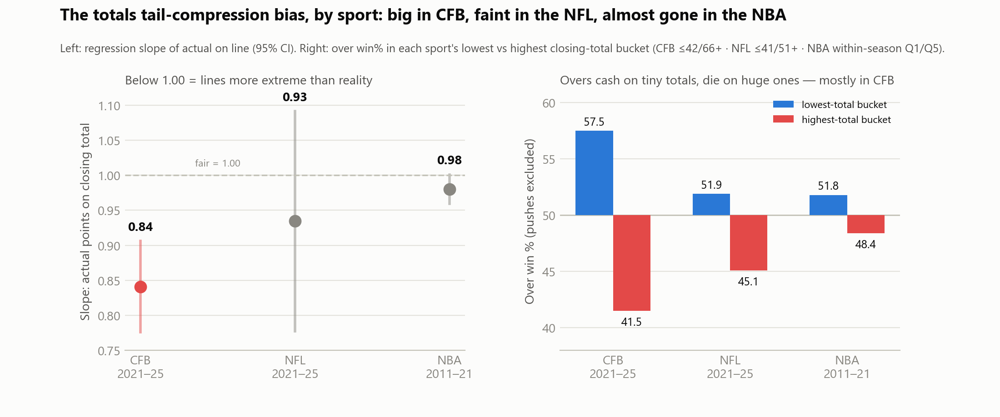

# Market Post-Mortem, Phase 2 — NFL (2021–2025) & NBA (2011–2021)

Same question as [the CFB run](MARKET_POSTMORTEM.md), same rules: grade the
books' closing numbers against reality, slice everything, and let
Benjamini–Hochberg (q=0.10) plus a persistence rule (pooled direction in ≥80%
of eligible seasons) kill the fake winners. Break-even at -110: **52.38%**.
Windows differ because the data differs: NFL from nflverse (closing lines
only — no opens), NBA from the local odds archive (opens AND closes, but
seasons 2011-12 through 2021-22 — that's what the archive holds).

## TL;DR (podcast version)

1. **The NFL is the sharpest board we tested. Nothing survives correction.**
   42 slices — home/away, every spread bucket, division games, byes, rest,
   primetime, weather, every total bucket, every moneyline band — and zero
   BH-significant results. The famous angles are priced in.
2. **The CFB findings are CFB findings, not football findings.** The
   favorite–longshot bias that torched −22.9% on college +401 dogs? NFL +251
   dogs lost −9.4% (not significant), NBA +401 dogs lost −3.3% — basically
   just vig. The totals tail-compression (slope 0.84 in CFB) fades to 0.93 in
   the NFL (CI includes 1.00) and 0.98 in the NBA. **The more games, liquidity,
   and public attention a league gets, the harder its tails are priced.**
3. **The NBA's one real quirk: total-line moves carried information.**
   Following totals steam (≥1 pt move, bet the side the market moved toward)
   won 51.4% vs the close (n=10,471, p=.005, 9/11 seasons) — significant,
   persistent, and still unprofitable after juice. Spread steam: nothing
   (49.5%), same as CFB and the NFL.
4. **Openers lean opposite ways in college and the pros.** In CFB, dogs graded
   vs the open beat dogs at the close (openers too chalky). In the NBA it
   flips: favorites at the open beat favorites at the close (51.1% vs 50.0%;
   dogs at the open only 48.9%, p=.014, 9/11 seasons). College openers
   overrate favorites; NBA openers underrate them. Both markets fix it by
   tip-off.
5. **NFL watch list (real-ish, unproven):** primetime unders 55.7% (5/5
   seasons, p=.060), the classic 7–9.5-point dogs 55.9% ATS (4/5), early-season
   unders 54.9% (5/5). And the old-school wind card still cashed: unders in
   15+ mph wind went 57-36-2 (61.3%, +17% ROI) — but that's 93 games and one
   eligible season of data; treat it as an anecdote with a pulse.

---

## 1. Datasets

| | NFL | NBA |
|---|---|---|
| source | nflverse `games` (local `nfl_games.csv`) | local `nba_archive.json` |
| window | 2021–2025 incl. playoffs | 2011-12 – 2021-22 incl. playoffs |
| games graded | 1,424 | 13,893 |
| lines | closing spread/total/ML | open+close spread/total, closing ML |
| extras | rest days, division flag, roof, wind, primetime | rest days (derived), back-to-backs |

Data honesty, NBA: **933 games (6.7%) had the closing spread and total swapped
in the source columns.** Magnitude disambiguates; the recovered totals behave
exactly like clean ones (corr 0.61 with actual, same bias), but the recovered
spread's *sign* is uninformative (corr 0.01 with margins — we checked), so
those 933 closing spreads are excluded, never guessed. Ten rows with junk team
labels dropped. Franchise labels unified (NewJersey→Nets etc.). Before the
repair, the "analysis" showed home dogs covering 55.9% — a reminder that the
most exciting result in a dataset is usually a bug.

## 2. Calibration — three sports side by side

| | CFB 2021–25 | NFL 2021–25 | NBA 2011–21 |
|---|---|---|---|
| spread bias (actual − line) | +0.05 | +0.56 (SE 0.34) | −0.15 (SE 0.11) |
| spread slope (fair = 1.00) | 0.99 | 1.05 (SE 0.06) | 0.97 (SE 0.02) |
| spread MAE | 12.14 | 9.76 | 9.64 |
| total bias | +0.35 | +0.53 | +0.39 |
| **total slope** | **0.84 (≈5 SE < 1)** | 0.93 (SE 0.08) | 0.98 (SE 0.01) |
| ML Brier (devig home prob) | 0.185 | 0.212 | 0.204 |

The NFL's +0.56 home bias (home teams beat the close by half a point,
2021–25) is 1.7σ — suggestive, echoes the CFB 2024–25 home drift, not
provable yet. Home ATS was still just 49.7%. NBA home ATS 49.3% across the
decade — if anything the market *over*-rated NBA home court, and it knew it
by the close.

## 3. What survives correction

### NFL: nothing — 0 of 42

The full table is in `nfl_slice_results.csv`. The persistent-but-unproven
watch list (all fail FDR): primetime unders (162-129-4, 55.7%, 5/5), dogs
getting 7–9.5 (123-97-2, 55.9%, 4/5 — the dead-zone dog lives, barely),
weeks 1–4 unders (54.9%, 5/5), totals 41.5–44.5 unders (54.2%, 4/5). Wind
15+ unders went 61.3% but on 93 games. Nothing here is bettable on this
evidence; all of it is trackable.

### NBA: 5 of 42, and they tell two stories

| finding | n | result | read |
|---|---|---|---|
| All favorites ML / every fav band | 13,751 | −4.0 to −5.1% ROI, 11/11 seasons | **this is the vig, not a bias** — dogs lost the same or less (−1.5 to −3.3%), so unlike CFB there's no tail asymmetry to exploit |
| Follow totals steam (≥1) vs close | 10,471 | 51.4%, p=.005, 9/11 | total moves carried real info; still sub-break-even after juice |
| Dogs vs OPENING line (CLV check) | 12,468 | 48.9%, p=.014, 9/11 | NBA openers shade *toward dogs*; favorites gained value by close — mirror image of CFB |

Watch list: unders on each season's top total quintile hit 51.6% (10/11
seasons, p=.115) — the same *direction* as CFB's headline tail bias, an order
of magnitude smaller. The tail-compression gradient across sports is the
cleanest single takeaway of phase 2:

## 4. Cross-sport synthesis — the liquidity gradient

Rank the three boards by handle and attention per game: NFL > NBA > CFB.
Every bias we found lines up inversely:

| bias | CFB | NFL | NBA |
|---|---|---|---|
| longshot ML overpricing | −22.9% ROI ✔ | −9.4% (ns) | −3.3% (ns) |
| totals tail compression | slope 0.84 ✔ | 0.93 (ns) | 0.98 (ns, faint echo ✔ direction) |
| steam informative vs close | no | (no opens) | totals only, 51.4% ✔ |
| open→close correction | toward dogs ✔ | (no opens) | toward favorites ✔ |

The market doesn't misprice *football* or *basketball* — it misprices
**thin markets**: hundreds of college games a weekend, lopsided matchups
public money only touches for lottery tickets and overs. The NFL, with
sixteen games a week and industrial-scale sharp action, has none of it. This
is also why the CFB edges (U-TAIL, the ML guardrail) are worth automating and
the NFL/NBA "edges" are worth exactly a watch-list entry.

## 5. Statistical honesty

* 42 tests per sport, BH FDR q=0.10 within each sport's battery. NFL: 10
  slices at raw p<0.05 would be ~2 by chance; 4 hit; 0 survive BH. NBA: with
  13.9k games even 1-point edges reach p≈0, so significance is cheap and the
  ROI column is what matters — most "significant" NBA rows are the vig
  measured precisely.
* NBA persistence = ≥9 of 11 eligible seasons (≥50 decided bets each); NFL
  = ≥4 of 5 (≥25 each).
* NFL ATS/total ROI assumes -110 both ways (nflverse carries actual spread
  juice; it averages a shade under -110, so real ROI runs ~0.3% better than
  quoted). NBA archive has no spread juice at all — same -110 assumption.
* The NBA window (2011–2021) predates the current legal-betting liquidity
  era; if anything today's NBA board is *sharper* than these numbers.
* One book per game in both sources, no line shopping, playoffs included
  (NBA has no playoff flag, so no regular/playoff split — month splits stand
  in). NBA 2019-20 (bubble) and 2011-12 (lockout) are structurally weird
  seasons and are left in; the persistence rule absorbs them.
* CFB comparisons quote the phase-1 report; windows differ (NBA is
  2011–2021), so cross-sport rows are direction-and-magnitude comparisons,
  not like-for-like season matches.

## 6. Workbook implications (proposals only)

1. **No NFL/NBA panels in the workbook.** Nothing cleared the bar that
   U-TAIL and the ML guardrail cleared for CFB. Automating a 51-53% pattern
   institutionalizes noise.
2. **NFL primetime-under and 7–9.5-dog** belong on the same paper-bet Watch
   List pattern as the CFB three — if a 2026 NFL data feed ever joins the
   system, they're pre-registered candidates with 2021–25 priors.
   *(Done, July 2026: the four rules, exact definitions, grading and
   graduation criteria are frozen in
   [NFL_WATCHLIST_2026_PREREG.md](NFL_WATCHLIST_2026_PREREG.md).)*
3. **The CLV lesson generalizes.** In all three sports the close beat every
   mechanical follow strategy. The Upset Board's CLV column is the right
   scoreboard; an NFL/NBA version would need nothing new conceptually.

## Files

| file | what |
|---|---|
| `nfl_bets_2021_2025.csv` / `nba_bets_2011_2021.csv` | per-game datasets (Excel-ready) |
| `nfl_slice_results.csv` / `nba_slice_results.csv` | all 42 tests per sport |
| `nfl_results.json` / `nba_results.json` | calibration curves + headline stats |
| `analyze_nfl.py` / `analyze_nba.py` | loaders + batteries (NBA includes the line-swap repair) |
| `pm_common.py` | shared stats: Wilson CIs, BH FDR, persistence, calibration |
| `make_charts_phase2.py` → `charts/nfl_*.png, nba_*.png, phase2_*.png` | the four phase-2 charts |
